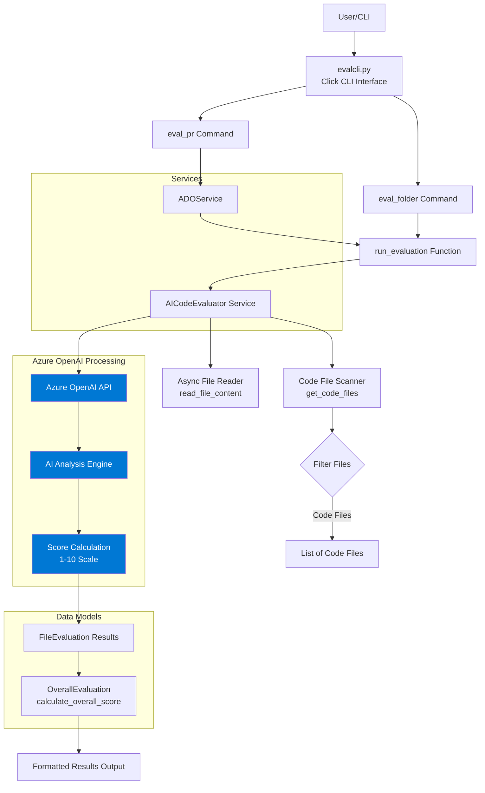

# AI Code Evaluator

A powerful CLI tool to analyze code files and determine the likelihood they were generated by AI code generation tools (like GitHub Copilot, ChatGPT, Claude, etc.).

## Overview

The AI Code Evaluator uses Azure OpenAI to analyze code files based on various factors including code style, patterns, comments, naming conventions, structure, error handling, and documentation. It provides both individual file scores and an overall assessment of a codebase.

## System Architecture



## Key Components

### 1. **evalcli.py** - CLI Entry Point
The main command-line interface built with Click that provides two primary commands:
- `eval_folder`: Evaluates code files in a local folder
- `eval_pr`: Evaluates code files from an Azure DevOps Pull Request

### 2. **CodeEvaluatorService.py** - Core Evaluation Logic
Contains the main evaluation engine with several key components:

#### Data Classes
- **FileEvaluation**: Stores evaluation results for individual files
  - `filename`: Relative path to the file
  - `score`: AI generation likelihood (1-10)
  - `reason`: Detailed explanation
  - `file_type`: File extension

- **OverallEvaluation**: Stores aggregated results
  - `score`: Overall AI generation likelihood (1-10)
  - `reason`: Summary explanation
  - `total_files`: Number of files analyzed
  - `file_evaluations`: List of individual file results

#### AICodeEvaluator Class
Main evaluation engine that:
- Initializes Azure OpenAI client
- Scans folders for code files (supports 25+ file extensions)
- Reads file content asynchronously
- Evaluates each file using AI analysis
- Calculates overall scores with weighted averages
- Supports concurrent evaluation with rate limiting (max 5 concurrent requests)

### 3. **ADOService.py** - Azure DevOps Integration
Handles Pull Request integration:
- Parses Azure DevOps PR URLs
- Authenticates with Azure DevOps
- Downloads modified files from PRs
- Creates temporary folder structure for evaluation

## Evaluation Criteria

The AI analyzes code based on these factors:

1. **Code Style & Patterns**: AI tends to generate consistent, structured code
2. **Comments**: AI often produces comprehensive, detailed comments
3. **Naming Conventions**: AI uses descriptive, sometimes verbose names
4. **Code Structure**: AI follows best practices rigidly
5. **Error Handling**: AI includes comprehensive error handling
6. **Documentation**: AI frequently adds docstrings and type hints
7. **Coding Patterns**: Identification of AI-typical patterns
8. **Personal Quirks**: Lack of human-specific shortcuts or quirks

## Scoring System

- **1-2**: Very unlikely to be AI-generated (clearly human-written)
- **3-4**: Probably human-written with possible AI assistance
- **5-6**: Could be either human or AI-written
- **7-8**: Likely AI-generated with possible human modifications
- **9-10**: Very likely AI-generated

## Installation

### Prerequisites
- Python 3.8+
- Azure OpenAI account and API credentials

### Install Dependencies
```bash
pip install -r requirements.txt
```

### Required Packages
- `click`: CLI framework
- `openai`: Azure OpenAI SDK
- `aiofiles`: Async file operations
- `python-dotenv`: Environment variable management
- `azure-devops`: Azure DevOps integration (for PR evaluation)

## Configuration

Create a `.env` file in the project root with the following variables:

```bash
AZURE_OPENAI_ENDPOINT=https://your-endpoint.openai.azure.com/
AZURE_OPENAI_API_KEY=your-api-key
AZURE_OPENAI_DEPLOYMENT_NAME=your-deployment-name
AZURE_OPENAI_API_VERSION=2024-02-15-preview
```

For Azure DevOps PR evaluation, you may also need:
```bash
AZURE_DEVOPS_PAT=your-personal-access-token
```

## Usage

### Evaluate a Local Folder

```bash
python evalcli.py eval-folder /path/to/code
```

**With exclusions:**
```bash
python evalcli.py eval-folder /path/to/code \
  --exclude-ext .md --exclude-ext .txt \
  --exclude-folder tests --exclude-folder docs
```

### Evaluate an Azure DevOps Pull Request

```bash
python evalcli.py eval-pr \
  --pr-url "https://dev.azure.com/org/project/_git/repo/pullrequest/123"
```

**With exclusions:**
```bash
python evalcli.py eval-pr \
  --pr-url "https://dev.azure.com/org/project/_git/repo/pullrequest/123" \
  --exclude-ext .json --exclude-ext .xml \
  --exclude-folder config
```

## Command Reference

### `eval-folder`
Evaluate code files in a local directory.

**Arguments:**
- `FOLDER`: Path to the folder containing code files (required)

**Options:**
- `--exclude-ext`: File extensions to exclude (can be specified multiple times)
- `--exclude-folder`: Folder names to exclude (can be specified multiple times)

### `eval-pr`
Evaluate code files from an Azure DevOps Pull Request.

**Options:**
- `--pr-url`: Azure DevOps Pull Request URL (required)
- `--exclude-ext`: File extensions to exclude (can be specified multiple times)
- `--exclude-folder`: Folder names to exclude (can be specified multiple times)

## Supported File Extensions

The evaluator supports 25+ programming language file extensions:
- Python (`.py`)
- JavaScript/TypeScript (`.js`, `.ts`, `.jsx`, `.tsx`)
- Java (`.java`)
- C/C++ (`.c`, `.cpp`)
- C# (`.cs`)
- Go (`.go`)
- Rust (`.rs`)
- PHP (`.php`)
- Ruby (`.rb`)
- Swift (`.swift`)
- Kotlin (`.kt`)
- Scala (`.scala`)
- Shell scripts (`.sh`)
- PowerShell (`.ps1`)
- SQL (`.sql`)
- Web (`.html`, `.css`, `.vue`)
- Dart (`.dart`)
- R (`.r`)
- MATLAB (`.m`)

## Default Exclusions

The following folders are excluded by default:
- `.git`
- `node_modules`
- `__pycache__`
- `venv`
- `env`
- `.venv`
- Any folder starting with `.`

## Output Format

The tool provides detailed output including:

1. **Overall Score**: Aggregated AI generation likelihood (1-10)
2. **Overall Reason**: Summary explanation of the assessment
3. **Total Files Analyzed**: Number of code files evaluated
4. **Individual File Scores**: Detailed breakdown per file including:
   - File path
   - Score (1-10)
   - File type
   - Detailed reasoning

### Example Output

```
================================================================================
AI CODE GENERATION EVALUATION RESULTS
================================================================================

OVERALL SCORE: 7/10
REASON: Most files (8/10) show strong indicators of AI generation
TOTAL FILES ANALYZED: 10

INDIVIDUAL FILE SCORES:
--------------------------------------------------------------------------------

File: src/main.py
Score: 9/10
Type: .py
Reason: Comprehensive docstrings, rigidly structured error handling, and 
        overly descriptive variable names suggest AI generation...
----------------------------------------
```

## Performance Features

- **Asynchronous Processing**: Uses `asyncio` for concurrent file reading and evaluation
- **Rate Limiting**: Semaphore-based concurrency control (max 5 concurrent API requests)
- **Progress Tracking**: Real-time progress bar during evaluation
- **File Size Limits**: Automatically truncates files over 8000 characters to avoid token limits
- **Error Handling**: Graceful handling of file read errors and API failures

## Technical Details

### Asynchronous Architecture
The tool uses Python's `asyncio` library for efficient concurrent processing:
- Files are read asynchronously using `aiofiles`
- Multiple files can be evaluated simultaneously
- Semaphore limits concurrent API calls to prevent rate limit issues

### Azure OpenAI Integration
- Uses structured JSON output format for reliable parsing
- Temperature set to 0.1 for consistent, deterministic results
- System prompt optimized for code analysis
- Automatic retry logic for API errors

### Folder Traversal
- Recursive directory scanning with `Path.rglob()`
- Efficient filtering with set-based lookups
- Respects default exclusions and user-specified exclusions

## Error Handling

The tool handles various error scenarios:
- Invalid Azure OpenAI credentials
- File read errors (encoding issues, permissions)
- API failures or timeouts
- JSON parsing errors in AI responses
- Empty folders or no code files found

## Limitations

- Maximum file size analyzed: 8000 characters (to avoid token limits)
- Concurrent API requests: Limited to 5 to avoid rate limiting
- Requires active Azure OpenAI subscription
- PR evaluation only supports Azure DevOps (not GitHub or GitLab)

## Future Enhancements

Potential improvements for future versions:
- Support for GitHub and GitLab PR evaluation
- Configurable scoring thresholds
- Export results to JSON/CSV
- Integration with CI/CD pipelines
- Custom evaluation criteria
- Caching mechanism for previously evaluated files
- Support for code diffs in PR evaluation

## Contributing

When contributing to this project:
1. Follow existing code style and patterns
2. Add appropriate docstrings and type hints
3. Test with various code samples
4. Update this README for any new features

## License

[License information to be added]

## Support

For issues, questions, or contributions, please refer to the main repository documentation.
